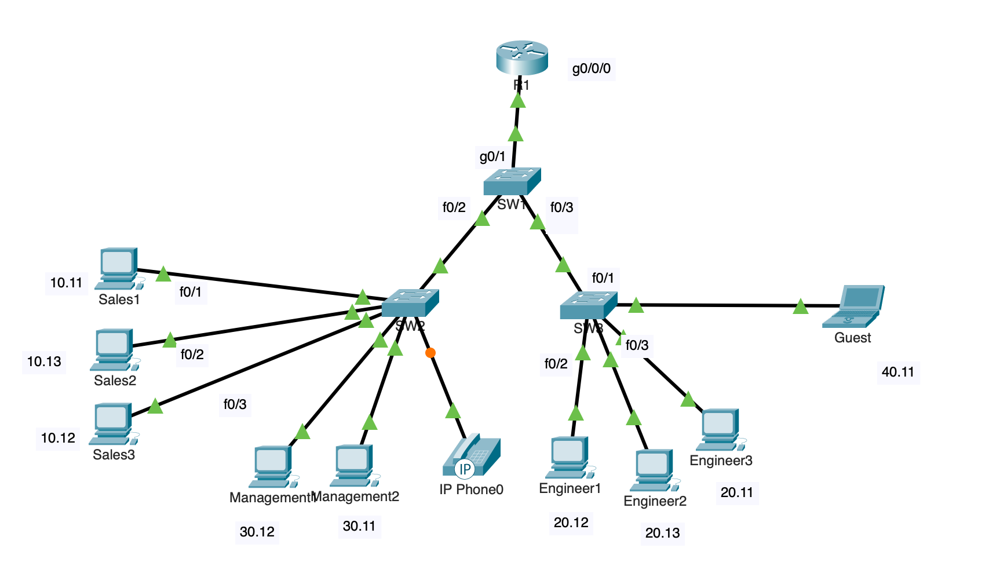
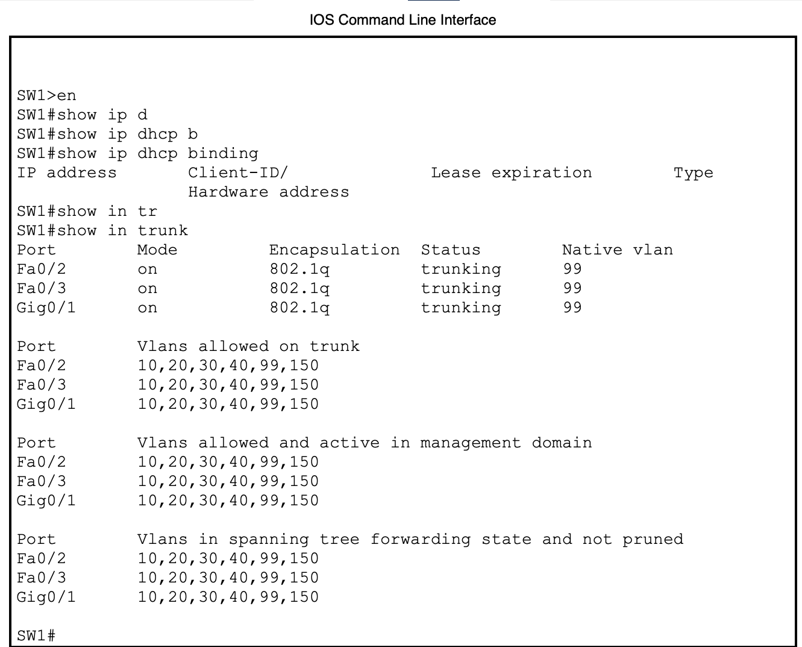
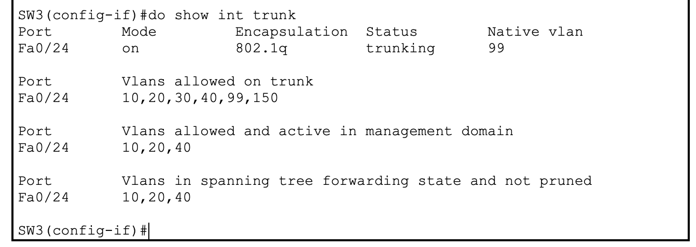
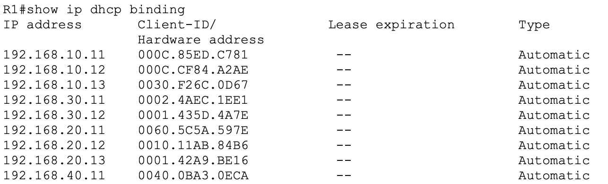
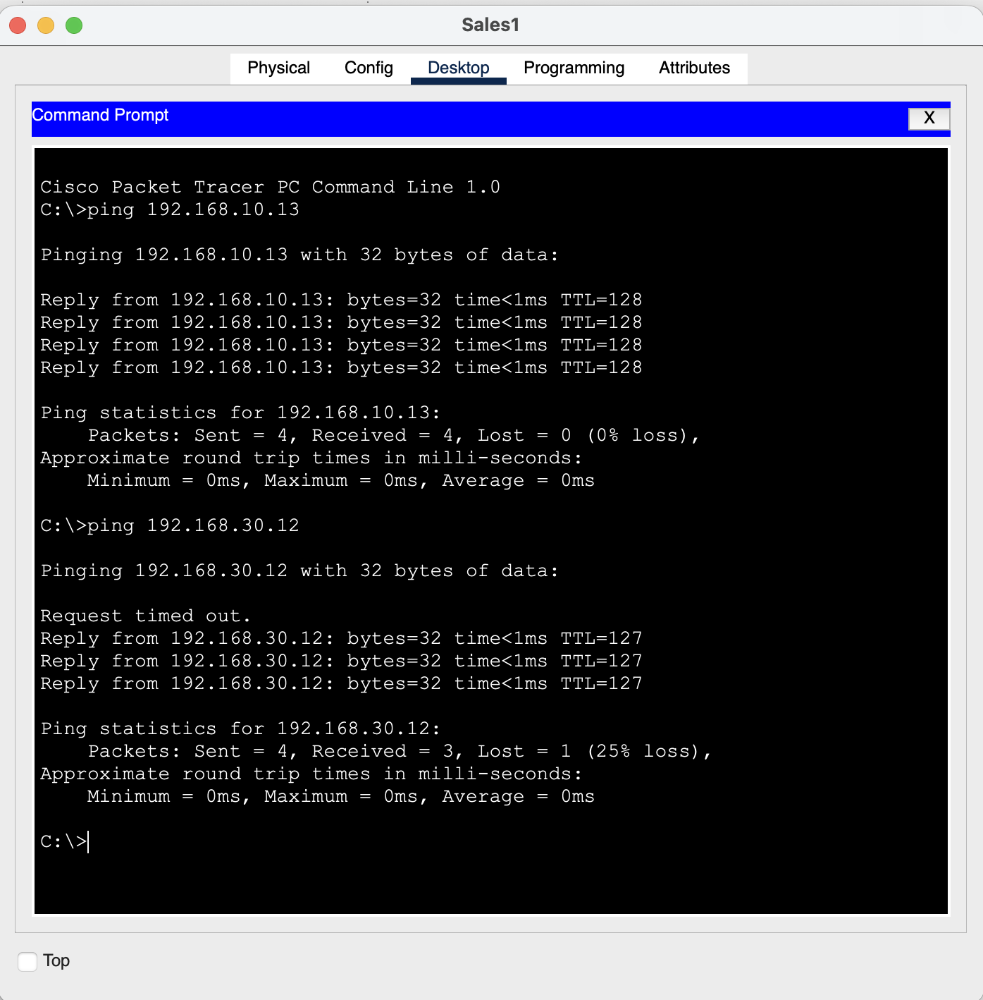
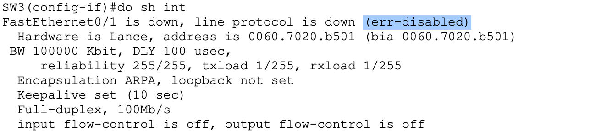

# Lab 1: Multi-VLAN Branch Office with Inter-VLAN Routing

## Objective
Design and implement a small branch-office network with multiple VLANs for traffic segmentation, using router-on-a-stick for inter-VLAN routing, trunking between switches, DHCP per VLAN, and basic Layer 2 security (port security, native VLAN hardening).

## Topology



## VLAN & Addressing Table

| VLAN ID | Name | Subnet | Gateway (R1) | Switch / Ports |
|---|---|---|---|---|
| 10 | Sales | 192.168.10.0/24 | 192.168.10.1 | SW2 Fa0/1–5 |
| 20 | Engineering | 192.168.20.0/24 | 192.168.20.1 | SW3 Fa0/1–5 |
| 30 | Management | 192.168.30.0/24 | 192.168.30.1 | SW2 Fa0/6–10 |
| 40 | Guest | 192.168.40.0/24 | 192.168.40.1 | SW3 Fa0/6–10 |
| 99 | Native (mgmt) | 192.168.99.0/24 | 192.168.99.1 | All trunk links |
| 150 | Voice | 192.168.150.0/24 | 192.168.150.1 | SW2 Fa0/11 |

## Design Decisions

- **Router-on-a-stick vs. Layer 3 switch:** Chose router-on-a-stick to reinforce 802.1Q sub-interface configuration and trunk encapsulation, which is more heavily tested at the CCNA level and more common in smaller branch deployments where a dedicated L3 switch isn't cost-justified.
- **VLAN 99 as native, not VLAN 1:** Using a non-default native VLAN prevents VLAN-hopping attacks that rely on double-tagging through the default native VLAN, and keeps untagged management traffic off VLAN 1.
- **Port security on access ports:** Limits MAC addresses per port to reduce risk of unauthorized devices or MAC flooding on access-layer ports, with `restrict` mode logging rather than full lockout for this lab.
- **Voice VLAN on a data port (Fa0/11):** Reflects a real-world deployment pattern where an IP phone and PC share a single access port, with the phone tagging its own traffic into VLAN 150 while the PC stays untagged on the data VLAN.
- **No DHCP pool for Voice VLAN:** In production, IP phones typically pull configuration via DHCP option 150/TFTP, which is beyond CCNA/Packet Tracer scope — phones were statically addressed for this lab.

## Verification

All verification commands and outputs below confirm the network is functioning as designed.

- `show vlan brief` (all switches) — confirms VLAN-to-port assignments
- `show interfaces trunk` (SW1, SW2, SW3) — confirms trunk links and native VLAN 99
- `show ip dhcp binding` (R1) — confirms DHCP leases issued per VLAN
- `show interfaces Fa0/0.10` (and .20, .30, .40, .150 on R1) — confirms sub-interfaces up/up
- PC-to-PC ping within same VLAN — successful
- PC-to-PC ping across VLANs (e.g., Sales → Engineering) — successful, confirming inter-VLAN routing via R1






## Known Gaps / Next Steps

- **No traffic restriction between VLANs yet** — currently, Guest (VLAN 40) can reach Management (VLAN 30) and all other VLANs. This is intentional for Lab 1 to first prove routing works, and will be addressed with ACLs in Lab 4 (Sales/Engineering/Guest segmentation).
- **No gateway redundancy** — a single router is a single point of failure for inter-VLAN routing. In production, this would be addressed with a second router/L3 switch and HSRP or VRRP.
- **`errdisable recovery` automation not testable in Packet Tracer** — see troubleshooting notes below.



## Troubleshooting Notes

While building this lab, connecting a switch uplink to a port pre-configured with `spanning-tree portfast` (intended for end hosts) triggered **BPDU Guard**, which immediately put the port into an `err-disabled` state. `no shutdown` alone did not clear it, since `err-disabled` is a distinct state from a manual administrative shutdown.

**Resolution:**
1. Moved the switch-to-switch uplink off the access port and onto the dedicated trunk port (Fa0/24).
2. Cleared the err-disabled state by manually bouncing the interface:
   ```
   interface Fa0/1
    shutdown
    no shutdown
   ```
3. Confirmed recovery with `show interfaces status`.

In a production environment, `errdisable recovery cause bpduguard` with a recovery interval would automate this; Packet Tracer's simulated IOS does not reliably support this command, so manual recovery was used and documented here instead.

## Configs

Full running-configs for R1, SW1, SW2, and SW3 are included in this repo under `/configs`.
