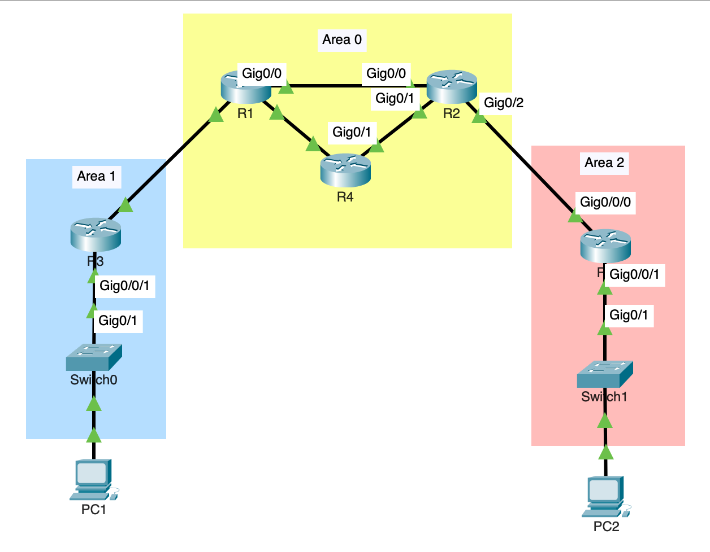
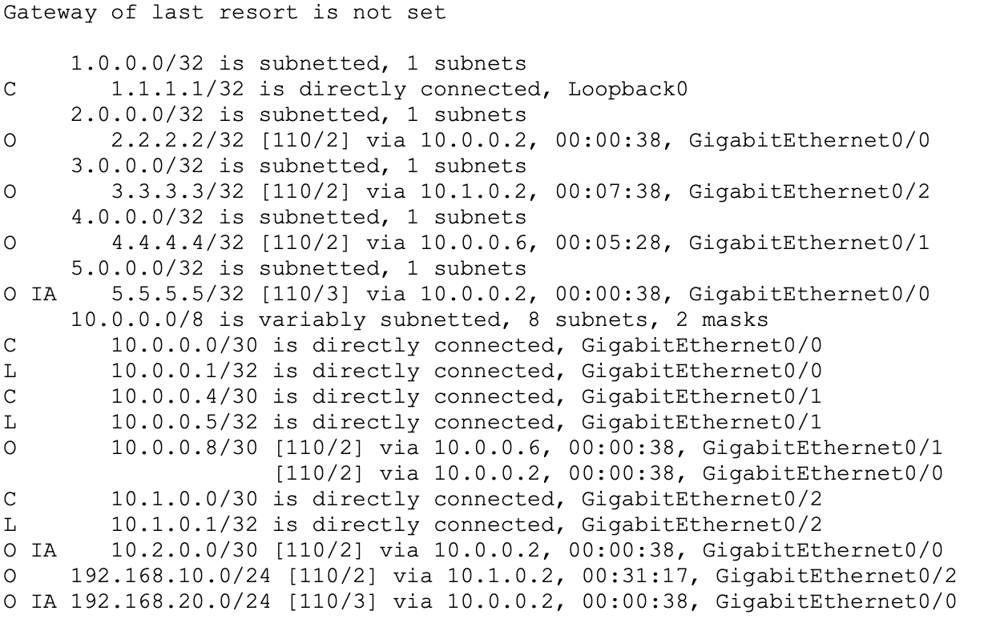
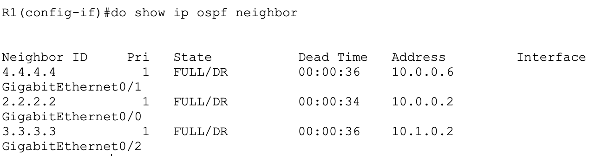
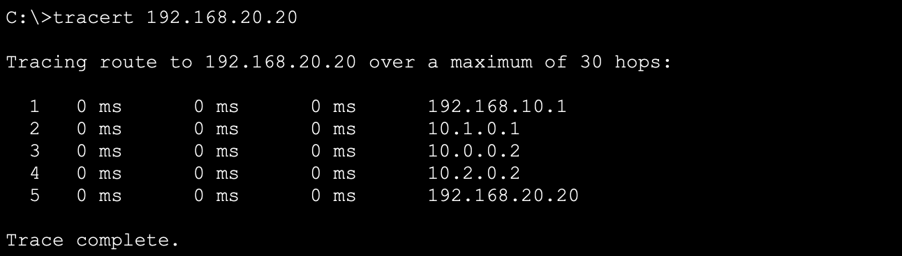
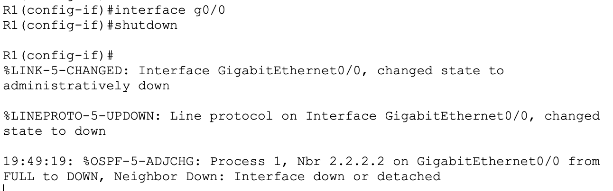
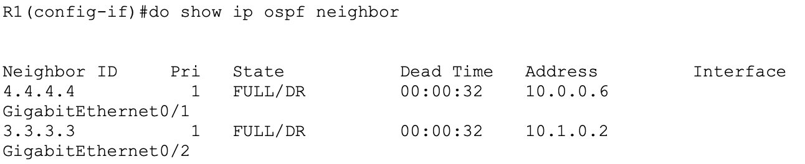
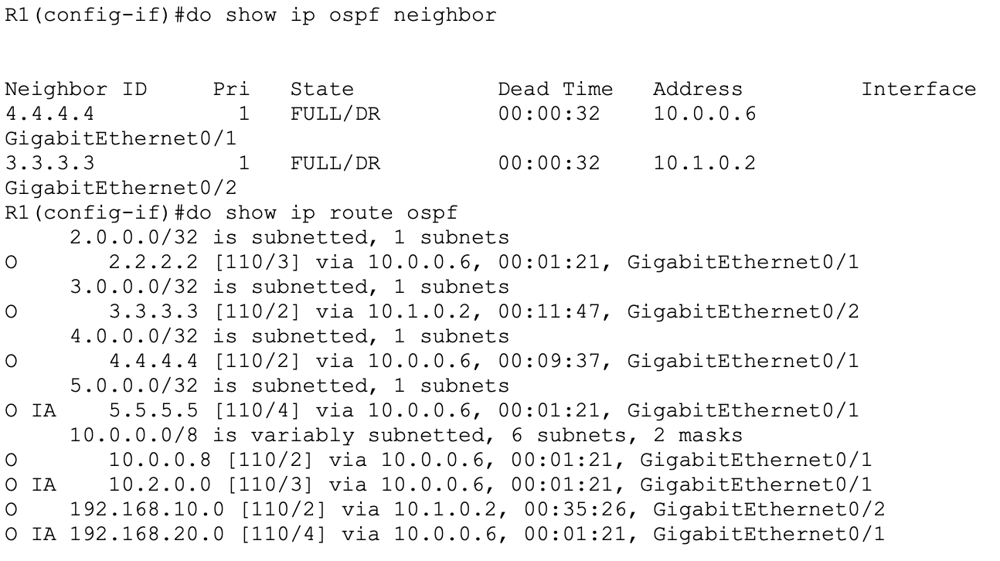
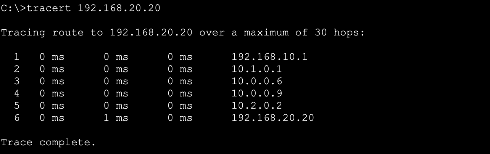
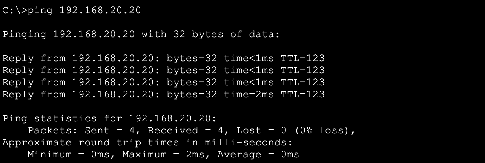
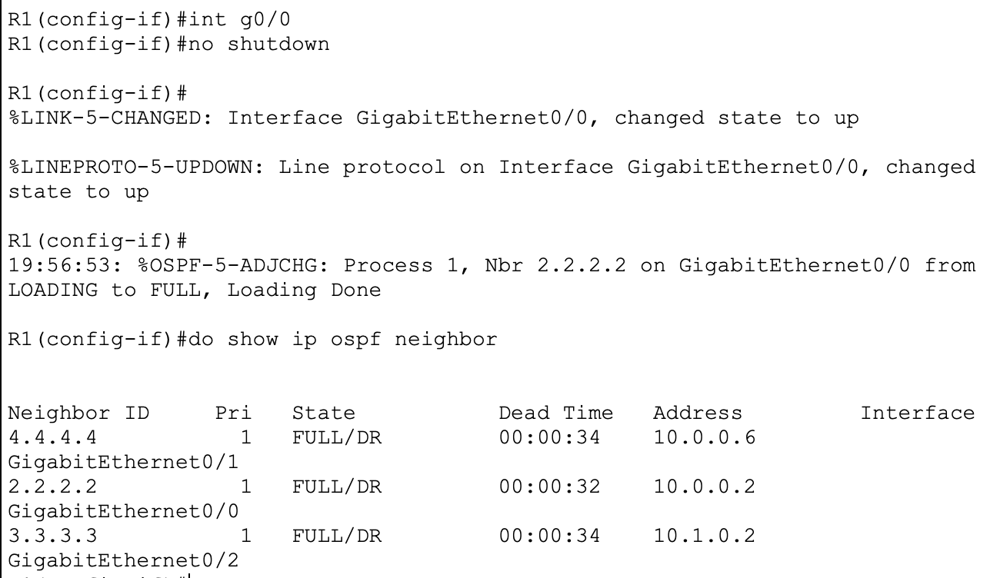

# Lab 2: OSPF Multi-Area Network with Redundancy

## Objective
Design and implement a multi-area OSPF network with a redundant backbone path, route summarization at area boundaries, and OSPF authentication. Validate resiliency by simulating a backbone link failure and confirming traffic reroutes via the redundant path, with both routing-table and traceroute evidence.

## Topology



```
                         Area 0 (Backbone)
                    [R1]------------------[R2]
                   /    \                /    \
            (Area 1)   (Area 0)    (Area 0)  (Area 2)
                |          \        /            |
              [R3]          [R4 - internal]      [R5]
            (Area 1)        (Area 0)           (Area 2)
                |                                 |
              [SW1]                             [SW2]
            VLAN 10 (Branch-A LAN)            VLAN 20 (Branch-B LAN)
                |                                 |
              PC1                               PC2
        192.168.10.10                      192.168.20.20
```

R1 and R2 form the Area 0 backbone and are both Area Border Routers (ABRs), connecting to Area 1 (via R3) and Area 2 (via R5) respectively. R4 sits fully within Area 0 and provides a redundant path between R1 and R2, independent of their direct link.

## IP Addressing

| Link | Network | R1 | R2 | R3 | R4 | R5 |
|---|---|---|---|---|---|---|
| R1–R2 (Area 0) | 10.0.0.0/30 | .1 | .2 | | | |
| R1–R4 (Area 0) | 10.0.0.4/30 | .5 | | | .6 | |
| R2–R4 (Area 0) | 10.0.0.8/30 | | .9 | | .10 | |
| R1–R3 (Area 1) | 10.1.0.0/30 | .1 | | .2 | | |
| R2–R5 (Area 2) | 10.2.0.0/30 | | .1 | | | .2 |
| R3 LAN (Area 1) | 192.168.10.0/24 | | | .1 | | |
| R5 LAN (Area 2) | 192.168.20.0/24 | | | | | .1 |

**Loopbacks (used as OSPF Router IDs):**

| Router | Loopback0 |
|---|---|
| R1 | 1.1.1.1/32 |
| R2 | 2.2.2.2/32 |
| R3 | 3.3.3.3/32 |
| R4 | 4.4.4.4/32 |
| R5 | 5.5.5.5/32 |

**End hosts:**

| Host | IP Address | Gateway |
|---|---|---|
| PC1 | 192.168.10.10 | 192.168.10.1 (R3) |
| PC2 | 192.168.20.20 | 192.168.20.1 (R5) |

## Design Decisions

- **Multi-area OSPF over single-area:** Splitting the network into Area 0 (backbone), Area 1, and Area 2 reduces the SPF calculation scope and LSA flooding domain for each area, improving scalability and convergence speed compared to a flat single-area design — directly relevant as a network grows beyond a handful of routers.
- **Loopback interfaces as Router IDs:** Loopbacks never go down due to a physical link failure, making them a more stable basis for the OSPF Router ID than a physical interface address. Configured on every router and marked passive to prevent unnecessary adjacency attempts.
- **R4 as a redundant backbone path:** Rather than relying solely on the direct R1–R2 link, R4 provides a second path through Area 0. This was the basis for the convergence demo below.
- **Route summarization at ABRs:** `area range` commands on R1 (for Area 1) and R2 (for Area 2) summarize each area's LAN subnet at the boundary, reducing the number of routes advertised into the backbone — a real scalability practice, not just a CCNA checkbox.
- **OSPF authentication (MD5) on all Area 0 links:** Originally added only on R1 and R2, this caused an authentication mismatch with R4 (see Troubleshooting below). Resolved by applying `area 0 authentication message-digest` and matching MD5 keys consistently across all three Area 0 routers, reflecting how authentication should be deployed uniformly in production rather than partially.

## Verification

- `show ip ospf neighbor` (all 5 routers) — confirms FULL adjacencies across all expected links
- `show ip route ospf` (R3, R5) — confirms inter-area (O IA) routes for the opposite area's LAN subnet, validating both routing and summarization
- `show ip ospf interface brief` — confirms correct area assignment per interface
- `show ip protocols` — confirms router ID, passive interfaces, and area authentication settings
- PC1 → PC2 ping — successful end-to-end across both areas and the backbone

## Convergence Demo: Simulating Backbone Link Failure

To validate redundancy in the Area 0 backbone, the direct R1–R2 link was deliberately shut down to confirm OSPF reroutes traffic through the redundant path via R4 — and that the reroute is reflected in both the routing table and actual packet forwarding.

**Before failure** — R1 routes to R2's networks via the direct link:




**Before failure** — traceroute from PC1 to PC2 shows the direct path through R1 → R2 → R5:



**Failure triggered** — R1–R2 link manually shut down:



**Immediately after** — neighbor relationship drops, OSPF reroutes via R4:




**After failure** — traceroute from PC1 to PC2 now shows the rerouted path through R1 → R4 → R2 → R5, one additional hop, confirming the redundant path is actually carrying traffic and not just present in the routing table:



**Traffic still flows** despite the failed link:



**Recovery** — link restored, neighbor relationship reforms:



## Troubleshooting Notes

**Issue 1: `passive-interface Loopback0` returned `% Invalid interface type and number`**

Root cause: the loopback interfaces had not yet been created on the routers. The `passive-interface` command requires the referenced interface to already exist — it cannot create or validate against an interface that hasn't been configured yet.

Resolution: created `interface Loopback0` with the appropriate IP on each router first, then successfully applied `passive-interface Loopback 0` (note the space — Packet Tracer's IOS is stricter about spacing between interface type and number than some documentation examples suggest).

**Issue 2: R1 and R2 formed an OSPF neighbor relationship with each other and with R3/R5 respectively, but R4 showed no neighbors at all**

Root cause: `area 0 authentication message-digest` had been applied on R1 and R2 only. This command requires every router with an interface in that area to authenticate — R4 had no authentication configured, creating a mismatch on every Area 0 link touching R4, and also affecting the R1–R2 direct link since the MD5 keys were not yet confirmed to match on both ends.

Resolution: applied `area 0 authentication message-digest` to R4 as well, then configured matching `ip ospf message-digest-key 1 md5 <key>` on both ends of every Area 0 link (R1–R2, R1–R4, R2–R4). Verified with `show ip ospf neighbor` showing all expected adjacencies as FULL afterward.

This was a useful reminder that area-wide OSPF commands apply a requirement to *every* router in that area — partial rollout across only some routers in an area will break adjacencies rather than just being ignored by the routers missing the config.

## Known Gaps / Next Steps

- **Authentication was only demonstrated on Area 0** — Area 1 and Area 2 links are not currently authenticated. In production, this would be applied network-wide.
- **No equal-cost load balancing demonstrated** — R4's path could be tuned with cost adjustments to explore unequal-cost path preference, which is a useful extension beyond CCNA scope.
- **Single redundant path** — only one backup path (via R4) exists. A more resilient design would include a second redundant path or a direct R3–R5 inter-area link for testing additional failure scenarios.

## Configs

Full running-configs for R1, R2, R3, R4, and R5 are included in this repo under `/configs`.
