# Lab 3: Spanning Tree + EtherChannel Redundancy

## Objective
Design and implement a redundant Layer 2 network using EtherChannel (LACP) to bundle physical links between switches, manual root bridge tuning to ensure deterministic STP election, and a deliberate physical loop to demonstrate Spanning Tree actively blocking a port to prevent a broadcast storm. Validate two distinct redundancy mechanisms through a two-stage failure scenario.

## Topology

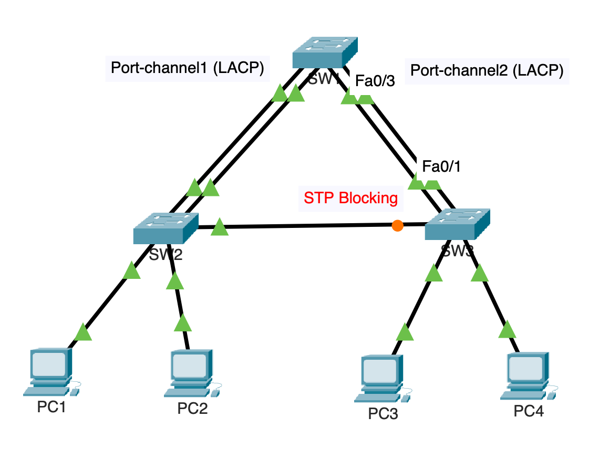

```
                    [SW1] - Core / Root Bridge
                   /              \
           Fa0/1-2 (Po1)      Fa0/3-4 (Po2)
           EtherChannel        EtherChannel
               |                    |
            [SW2]                [SW3]
          (Access)              (Access)
          /      \              /      \
        PC1      PC2          PC3      PC4

          [SW2]----Fa0/3----[SW3]
          (single redundant link — intentional loop, blocked by STP)
```

Three switches form a triangle topology. SW1 connects to SW2 and SW3 via LACP EtherChannel bundles (Port-channel1 and Port-channel2 respectively). SW2 and SW3 are also directly connected via a single trunk link — this is the deliberate physical loop that STP must manage by blocking one end.

## VLAN & Addressing

| VLAN | Name | Subnet | Purpose |
|---|---|---|---|
| 10 | Data | 10.10.10.0/24 | End host traffic |
| 99 | Native | 192.168.99.0/24 | Native VLAN on all trunks |

No router is used in this lab — it is purely Layer 2. PCs are statically addressed within the 10.10.10.0/24 subnet:

| Host | IP Address |
|---|---|
| PC1 | 10.10.10.1 |
| PC2 | 10.10.10.2 |
| PC3 | 10.10.10.3 |
| PC4 | 10.10.10.4 |

## Port Assignments

| Switch | Port(s) | Role |
|---|---|---|
| SW1 | Fa0/1–2 | EtherChannel to SW2 (Port-channel1) |
| SW1 | Fa0/3–4 | EtherChannel to SW3 (Port-channel2) |
| SW2 | Fa0/1–2 | EtherChannel to SW1 (Port-channel1) |
| SW2 | Fa0/3 | Single trunk link to SW3 (loop) |
| SW2 | Fa0/10–11 | Access ports — PC1, PC2 |
| SW3 | Fa0/1–2 | EtherChannel to SW1 (Port-channel2) |
| SW3 | Fa0/3 | Single trunk link to SW2 (loop) |
| SW3 | Fa0/10–11 | Access ports — PC3, PC4 |

## Design Decisions

- **Manual root bridge tuning over default election:** By default, STP elects the root bridge based on the lowest MAC address — essentially random from a design standpoint. SW1 was manually assigned a priority of 4096 (well below the default 32768) to guarantee it wins the election regardless of MAC address. SW2 and SW3 were set to 8192 to establish a clear backup root hierarchy if SW1 ever fails. This reflects real production practice where the core/distribution switch should always be root, not whichever switch happened to ship with the lowest MAC.
- **EtherChannel on FastEthernet, not Gigabit:** The Cisco 2960 only has two Gigabit uplink ports per switch, which is insufficient for two separate EtherChannel bundles. FastEthernet ports were used for the EtherChannel links instead — this is a realistic hardware constraint in small-branch and legacy deployments, not a lab shortcut, and is worth noting for any environment using older access-layer hardware.
- **SW2–SW3 link deliberately not channeled:** The direct link between SW2 and SW3 was intentionally left as a single trunk rather than added to an EtherChannel bundle. This creates the physical loop required to demonstrate STP actively blocking a port — without it, there would be no redundant path for STP to manage and the lab would only demonstrate EtherChannel, not STP topology management.
- **Rapid PVST+ over classic STP:** Rapid PVST+ (802.1w) was used for faster convergence during the failure demo — classic STP's 30–50 second convergence delay would make the lab difficult to observe cleanly. Rapid PVST+ also runs a separate STP instance per VLAN, allowing independent topology management for VLAN 10 and VLAN 99.
- **LACP `mode active` on both sides:** Both ends of each EtherChannel bundle were configured as LACP active, meaning either side can initiate negotiation. This is more robust than a passive/active pairing (where one side must initiate) and is the standard approach for switch-to-switch EtherChannel links.

## Baseline Verification

Before any failure testing, the following baseline state was confirmed:

- `show etherchannel summary` on SW1 — Port-channel1 and Port-channel2 both show as `(P)` with two active member links each
- `show spanning-tree vlan 10` on all three switches — SW1 confirmed as root bridge; SW3's Fa0/3 (the SW2–SW3 link) confirmed as **BLK** (blocking), preventing the loop
- PC1 → PC3 ping successful — full connectivity across the topology with one port blocked

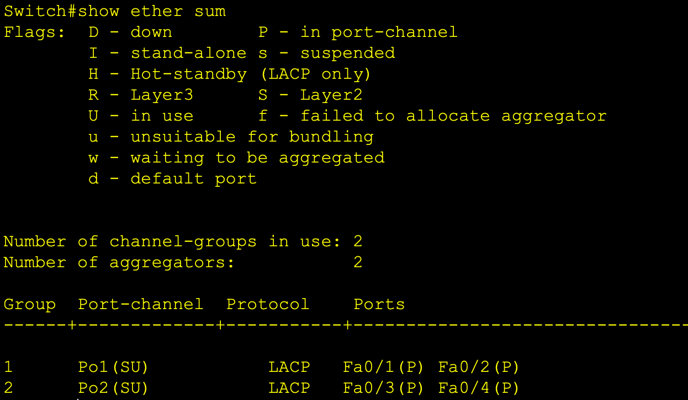
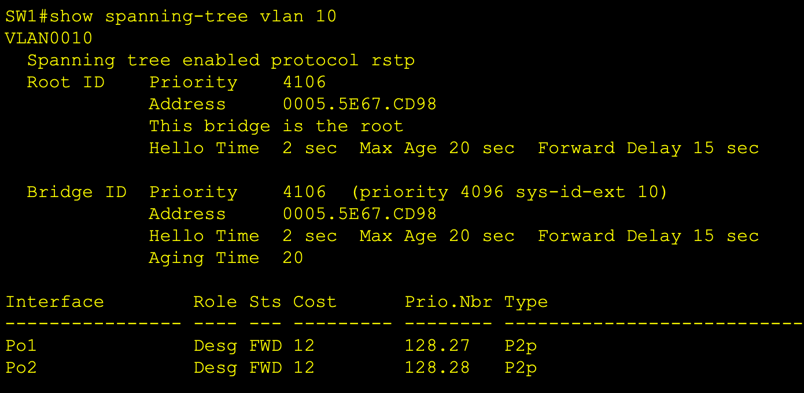
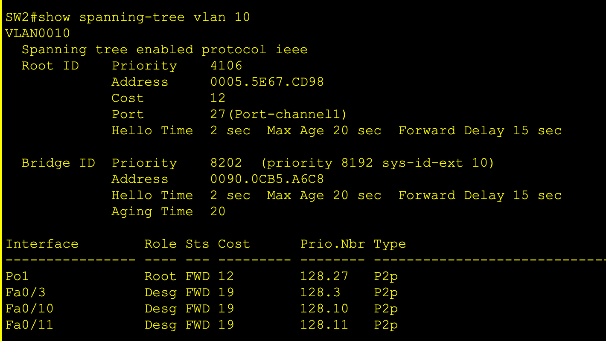
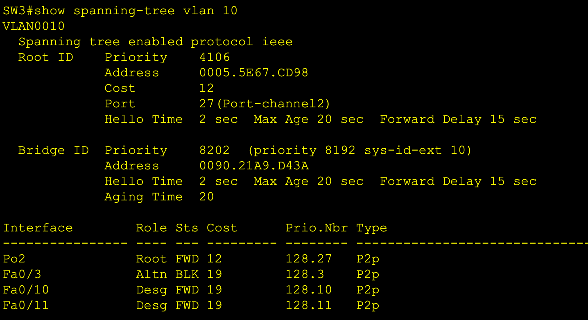
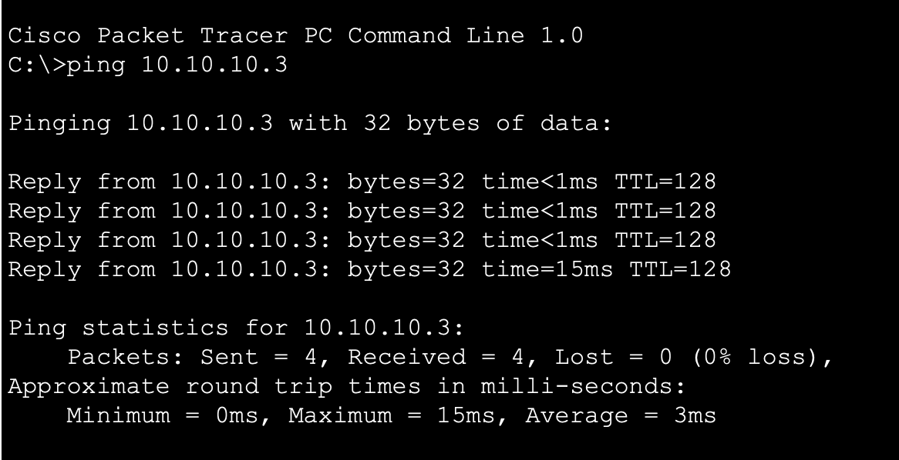

## Failure Demo: Two-Stage Redundancy Test

This lab demonstrates two distinct redundancy mechanisms responding to two different failure scenarios — EtherChannel handling link-level failure silently, and STP handling bundle-level failure through topology reconvergence.

### Stage 1: Single Link Failure Within an EtherChannel Bundle

One physical member port of Port-channel1 (Fa0/1 on SW1) was shut down, simulating a single cable or port failure within the bundle.

**Expected behavior:** EtherChannel absorbs the failure silently. Port-channel1 stays up with one remaining active member (Fa0/2). No STP topology change occurs — from STP's perspective, the logical link between SW1 and SW2 is still up.

**Observed:**
- `show etherchannel summary` — Port-channel1 remains `(P)`, Fa0/1 shows `(D)`, Fa0/2 remains active
- SW3's Fa0/3 remains **BLK** — STP did not recalculate, confirming EtherChannel handled the failure internally
- PC1 → PC3 ping still successful — no traffic interruption

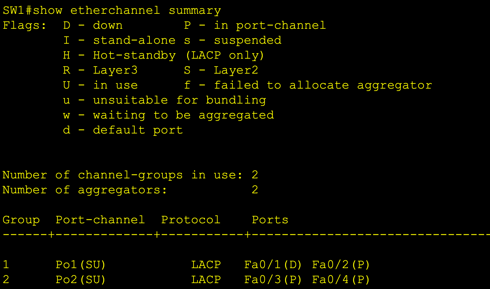
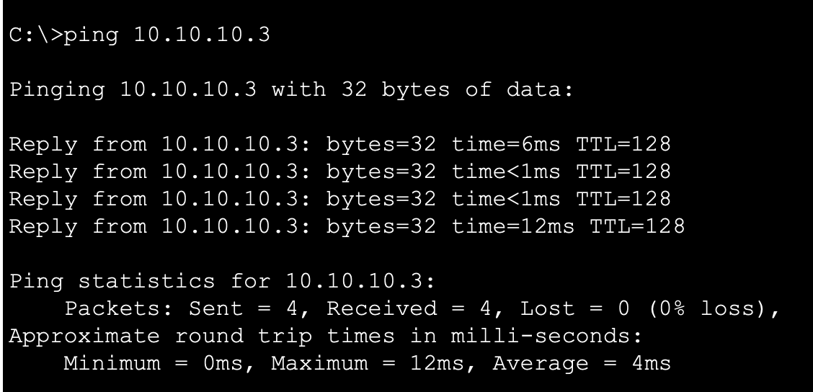

### Stage 2: Entire EtherChannel Bundle Failure

Port-channel1 itself was shut down entirely, simulating a complete loss of connectivity between SW1 and SW2.

**Expected behavior:** SW2 loses its uplink to SW1. STP detects the topology change and transitions SW3's Fa0/3 from **BLK** to **FWD** — the previously blocked SW2–SW3 link becomes the active forwarding path, keeping SW2 connected to the rest of the network via SW3.

**Observed:**
- `show spanning-tree vlan 10` on SW3 — Fa0/3 transitioned from **BLK** to **FWD**
- `show spanning-tree vlan 10` on SW2 — Fa0/3 now shows as the active Root Port
- PC1 → PC3 ping still successful — traffic now routes SW2 → SW3 → SW1 instead of directly via the bundle

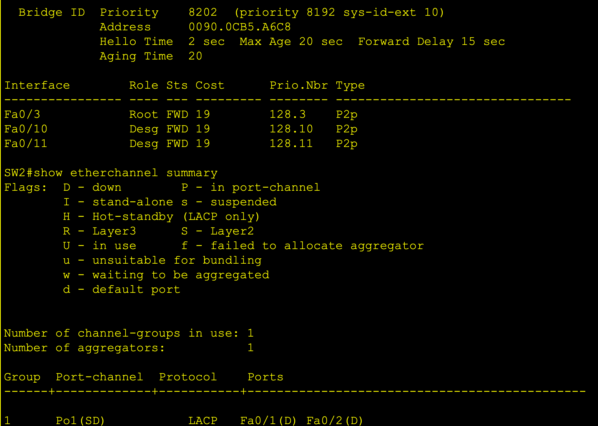
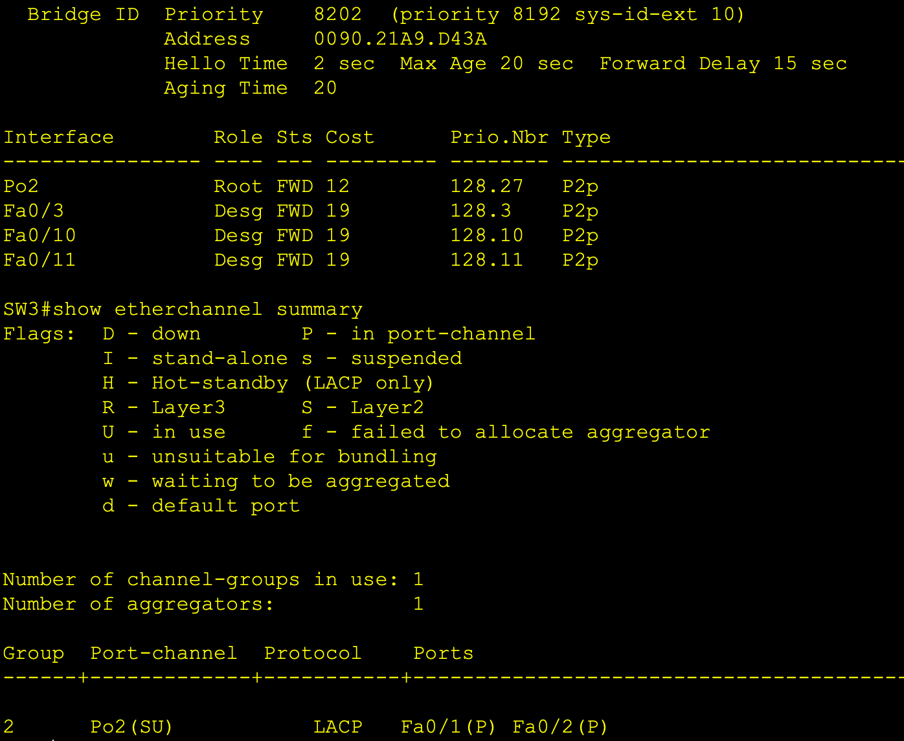
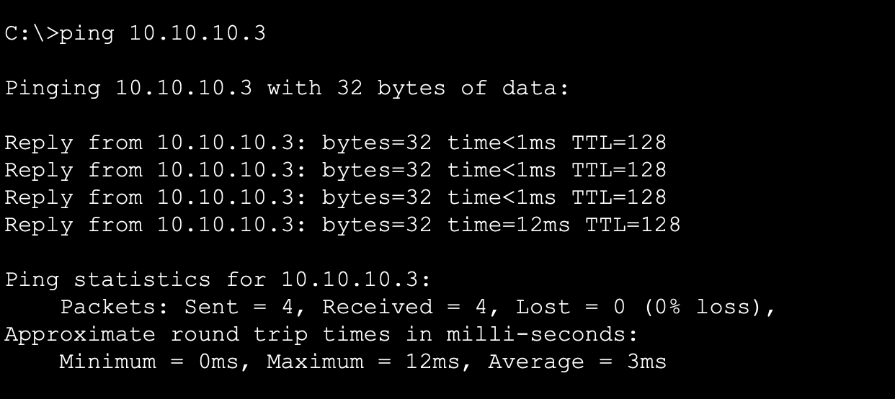

### Recovery

Both interfaces were restored (`no shutdown` on Port-channel1 and Fa0/1). STP reconverged to the original topology:

- Port-channel1 returned to `(P)` with both member links active
- SW3's Fa0/3 returned to **BLK**
- Full connectivity confirmed

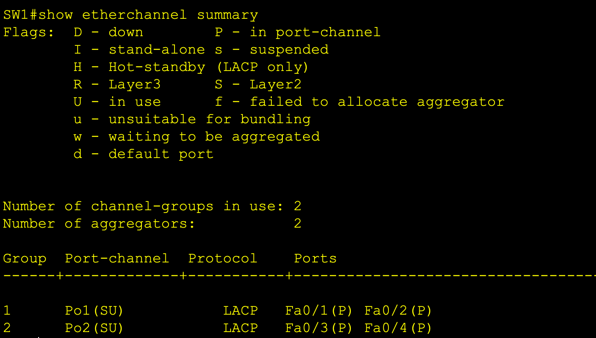
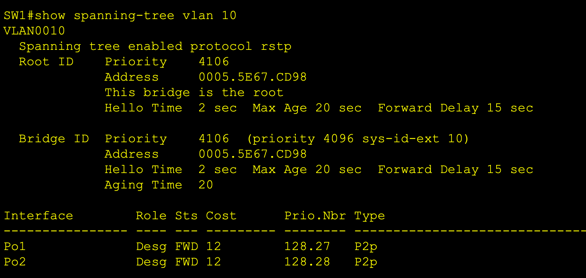

## Troubleshooting Notes

No significant issues were encountered during this build. EtherChannel formed cleanly on the first attempt with LACP `mode active` on both ends, and STP elected the correct root bridge and blocking port as designed. This was the third lab in the series — familiarity with trunk configuration, native VLAN assignment, and systematic verification (confirm interfaces are up before troubleshooting higher layers) from Labs 1 and 2 likely contributed to a cleaner build process.

For contrast, Labs 1 and 2 both produced real troubleshooting scenarios (BPDU Guard err-disabled ports and OSPF MD5 authentication mismatches respectively) that are documented in their own READMEs.

## Known Gaps / Next Steps

- **No PortFast/BPDU Guard on access ports toward end hosts** — in a production deployment, access ports facing PCs would have `spanning-tree portfast` and `spanning-tree bpduguard enable` configured to prevent accidental switch connections and speed up host link transitions. Demonstrated in Lab 1 but omitted here to keep focus on the EtherChannel and STP core concepts.
- **EtherChannel was only demonstrated on FastEthernet** — a production design on modern hardware would use Gigabit or higher for inter-switch links.
- **No Layer 3 routing** — this lab is purely Layer 2. VLANs and inter-VLAN routing will be revisited in Lab 4 (ACLs) and beyond.

## Configs

Full running-configs for SW1, SW2, and SW3 are included in this repo under `/configs`.
